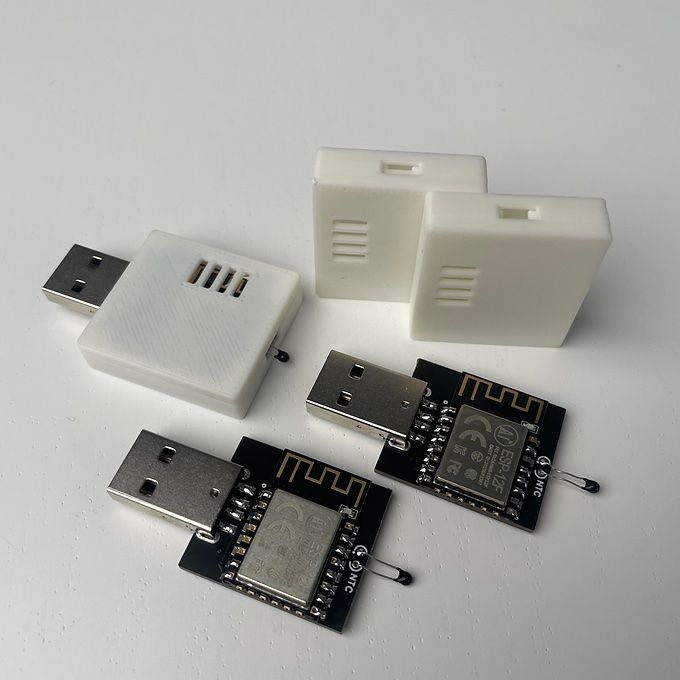

# SkyFan DC ESPhome Setup

The basic yaml config for the SkyfanDC made by Ventair flashing it onto your ESP8266 module and put it in the fan controller.
If you would like the physical module it is for ESPhome and Home Assistant only www.egglec.com.au
This module will not work with Tuya Smart App

Video about the fan : https://youtu.be/DethhMjQXy0

EasyEDA files : https://oshwlab.com/james_6977/sky-fan-dc

# SkyFan DC Module Version 2
If you have version 2 the pinout is different to accomodate the JST SH port that is for I2C, that port is connected to pins 4 and 5 which are the default I2C pins for the ESP8285.  In that case these are the files that you want for you module here at this repo.
The port on the module is 4pin JST SH 1mm and the same pinout as stemma qt 4 pin with 3.3v GND and SDA SCL, the idea is that it can be connected the the temperature sensor module such as the TMP117.

# Installation
If you bought a pre-made module, then you only need to plug it it, and setup up your wifi credentials via the access point it creates, which will be easy-skyfandc-MAC, then Home Assistant will discover it on your network and setup can be completed in the home assistant settings page.
You can also in settings change the name of the device and it's entities.
You don't need to have ESPhome installed or flash the device unless you want too.
Some reason's you may want to install ESPhome to is to add control over the SkyfanDC light(the only setting that you can't change is color temp, you will need to use the remote for that), or to add a sensor via the i2c port that is compatible with ESPhome like the TMP117.
  

If you have your own home made device you can flash it here if you like:
You can use the button below to install the pre-built firmware directly to your device via USB from the browser.

<esp-web-install-button manifest="./manifest.json"></esp-web-install-button>

